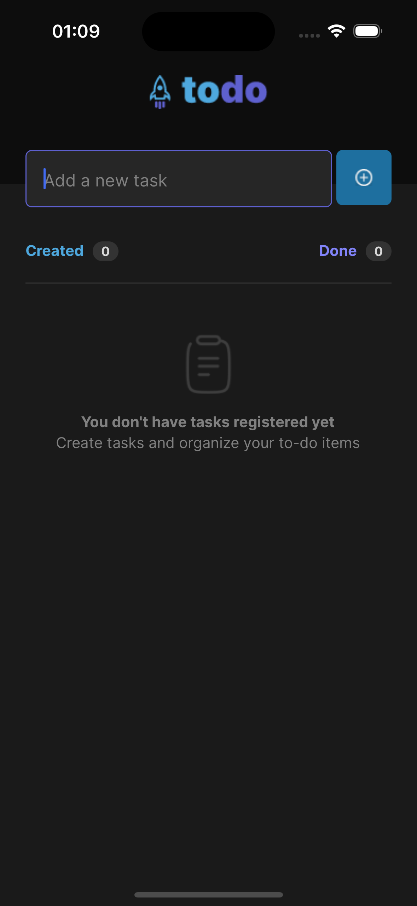

<p align="center">
  
</p>

<p align="center">
    <strong>Aplicativo mobile de todo list.</strong>
</p>

<p align="center">
  
  
  
  
</p>

<p align="center">
 <a href="#-sobre-o-projeto">Sobre</a> •
 <a href="#-funcionalidades">Funcionalidades</a> • 
 <a href="#-layout">Layout</a> • 
 <a href="#-tecnologias-utilizadas">Tecnologias</a> • 
 <a href="#-instalação-e-uso">Instalação</a> • 
 <a href="#-licença">Licença</a>
</p>


## 💻 Sobre o projeto

Essa aplicação apesar de simples é um excelente exemplo para praticar o desenvolvimento de apps CRUD (Create, Read, Update, Delete).

## ☑ Funcionalidades

- [x] Inserir tarefas
  - [x] Verificação de campo vazio
- [x] Alterar estado da tarefa
  - [x] Marcar como concluído
  - [x] Apagar tarefa


## 🎨 Layout

<p align="left">       
  
  
</p>

## 🔨 Tecnologias utilizadas

As seguintes ferramentas foram usadas na construção do projeto:

- **[ReactJS](https://reactjs.org/)**
- **[React Native](https://reactnative.dev/)**
- **[TypeScript](https://www.typescriptlang.org/)**

> Veja o arquivo [package.json](https://github.com/itsmevitinn/to-do/blob/main/package.json)


## 🚀 Instalação e uso

```bash
# Clone o repositório
git clone https://github.com/itsmevitinn/to-do.git

# Acesse a pasta do projeto
cd to-do

# Instale as dependências
npm install

# For Android
npx expo start --android

# For iOS
npx expo start --ios

# For physical device
npx expo start
```
> ***Physical devices only*** -> scan the QR code displayed in the terminal with Expo Go (Android) or the Camera app (iOS)

## 📝 Licença

<a href="https://opensource.org/licenses/MIT">
    
</a>

Esse projeto está sob a licença MIT. Veja o arquivo [LICENSE](./LICENSE.md) para mais detalhes.

---

Feito com 💜 por [Vitor Sergio](https://github.com/itsmevitinn)
